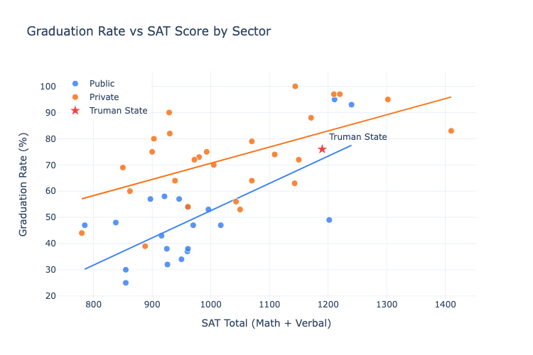

# Graduation Rates vs SAT (Public vs Private)

# Overview
This project started as a statistics case study at Truman State University (see `reports/assignment.pdf`) and was extended with Python automation and SQL data loading. Using a dataset of 47 schools (20 public, 27 private), I cleaned and analyzed the data to quantify how SAT scores relate to graduation rates, including EDA, regression modeling, and diagnostic checks.

## 🎯 Goal
**Objective:** Analyze how **SAT (Math + Verbal)** scores relate to **graduation rates**, and determine whether this relationship differs significantly between **public** and **private** institutions.

## ✨ What’s inside

- Cleaned dataset + reproducible notebook analysis
- Correlation + separate OLS regressions (Public vs Private)
- Single ANCOVA-style model with interaction: `graduation_rate ~ sat_total * sector`
- SQL seed file to load the dataset into a database (SQLite/MySQL/Postgres, etc.)

---

## 📦 Data

- **Raw:** `data/GradRates.xlsx`
- **Cleaned:** `data/grad_rates_clean.csv`
- **SQL seed:** `sql/grad_rates.sql` (create table + inserts)

Columns:
- `sector`: `Public` / `Private`
- `graduation_rate`: percent
- `sat_total`: SAT Math + Verbal
- `sat_imputed`: `1` if SAT was imputed from ACT (marked with `*` in the spreadsheet)

---

## 🔎 Key findings (reproducible)

Correlations (SAT vs graduation rate):
- **Public:** r = 0.701 (p = 0.0005742)
- **Private:** r = 0.572 (p = 0.001805)

Separate least-squares regressions:
- **Public:** `graduation_rate = -51.385 + 0.103957 × sat_total`
- **Private:** `graduation_rate = 8.939 + 0.061701 × sat_total`

Truman prediction (SAT ≈ 1190):
- **Predicted:** 72.3%
- **Actual:** 76%
- **Error (Actual − Predicted):** 3.7 percentage points

### Bonus: single model (ANCOVA-style)
I also fit one model with an interaction term:
- Model: `graduation_rate ~ sat_total * sector`
- Interaction (slope difference) p-value: **0.175**

See: `notebooks/analysis.ipynb`

## 📊 Figures



## 🚀 Getting started

### Prerequisites
- Python 3.9+ recommended (on macOS, use `python3`)

### Setup
```bash
python3 -m venv .venv
source .venv/bin/activate   # Windows: .venv\Scripts\activate

# Install dependencies
pip install -r requirements.txt

# Generate SQL seed file (from Excel/CSV)
python3 src/generate_sql.py

# Run the analysis
jupyter lab
```

## 🧱 Repo structure
- `notebooks/analysis.ipynb` – full, reproducible analysis
- `src/generate_sql.py` – converts the Excel sheet into a SQL seed file
- `sql/grad_rates.sql` – generated SQL (create table + inserts)
- `figures/` – charts used in the report/README
- `reports/` – assignment prompt + original write-up
- `data/` – raw + cleaned data
