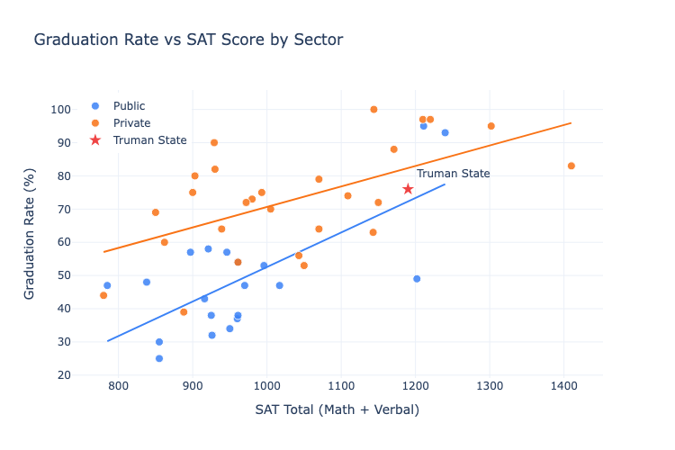

# Graduation Rates vs. SAT Scores — Public vs. Private Colleges


An end-to-end statistical analysis pipeline examining the relationship between SAT scores and graduation rates across 47 U.S. colleges, segmented by institutional sector (public vs. private). The project covers data cleaning, exploratory analysis, OLS regression modeling, ANCOVA-style interaction testing, and SQL-based data exploration.

---

## 🎯 Research Question

> **Does the relationship between SAT scores and graduation rates differ significantly between public and private institutions?**

---

## 🔑 Key Findings

### Correlation (SAT Total vs. Graduation Rate)

| Sector | r | p-value | Interpretation |
|--------|---|---------|----------------|
| Public | 0.701 | 0.0006 | Strong, highly significant |
| Private | 0.572 | 0.0018 | Moderate, significant |

Both sectors show a statistically significant positive correlation, but the relationship is stronger among public institutions.

### OLS Regression Models

| Sector | Intercept | Slope (per SAT point) |
|--------|-----------|-----------------------|
| Public | −51.39 | +0.1040 |
| Private | +8.94 | +0.0617 |

Public colleges show a steeper slope: each additional SAT point associates with a larger gain in graduation rate compared to private colleges.

### Interaction Test (ANCOVA-style)

Model: `graduation_rate ~ sat_total * sector`

The interaction term (slope difference between sectors) yielded **p = 0.175**, indicating the difference in slopes is **not statistically significant** at α = 0.05. While descriptive differences exist, we cannot reject the null hypothesis of equal slopes.

---

## 📦 Data

| File | Description |
|------|-------------|
| `data/GradRates.xlsx` | Raw dataset (47 colleges) |
| `data/grad_rates_clean.csv` | Cleaned, analysis-ready CSV |
| `sql/grad_rates.sql` | SQL seed file (CREATE TABLE + INSERT) |

**Schema:**

| Column | Type | Description |
|--------|------|-------------|
| `sector` | TEXT | `Public` or `Private` |
| `graduation_rate` | REAL | 6-year graduation rate (%) |
| `sat_total` | INTEGER | SAT Math + Verbal combined score |
| `sat_imputed` | INTEGER | `1` = SAT was estimated from ACT conversion |

> **Note on imputation:** 5 colleges reported ACT scores only. SAT equivalents were estimated using published concordance tables. A sensitivity analysis excluding imputed records is included in the notebook and yields consistent results.

---

## 📊 Figures

**Scatter plot with sector-specific regression fits:**



---

## 🗂️ Repository Structure

```
graduation-rates-sat-analysis/
├── data/
│   ├── GradRates.xlsx          # Raw data
│   └── grad_rates_clean.csv    # Cleaned data
├── docs/
│   └── methodology.md          # Analysis methodology & write-up
├── figures/
│   └── scatter_with_fits.png   # Main visualization
├── notebooks/
│   └── analysis.ipynb          # Full reproducible analysis
├── sql/
│   ├── grad_rates.sql          # Seed file (schema + data)
│   └── analysis_queries.sql    # Analytical SQL queries
├── src/
│   └── generate_sql.py         # Script: Excel → SQL seed
├── .gitignore
├── LICENSE
├── README.md
└── requirements.txt
```

---

## 🚀 Getting Started

### Prerequisites

- Python 3.9+
- Jupyter Lab

### Setup

```bash
# Clone the repo
git clone https://github.com/DungLe-304/graduation-rates-sat-analysis.git
cd graduation-rates-sat-analysis

# Create and activate virtual environment
python3 -m venv .venv
source .venv/bin/activate        # Windows: .venv\Scripts\activate

# Install dependencies
pip install -r requirements.txt

# (Optional) Regenerate the SQL seed file from source data
python3 src/generate_sql.py

# Launch the analysis notebook
jupyter lab
```

Then open `notebooks/analysis.ipynb` and run all cells.

---

## 🧱 SQL Layer

The `sql/` directory provides two files for database-oriented exploration:

- **`grad_rates.sql`** — Creates the `grad_rates` table and seeds all 47 records
- **`analysis_queries.sql`** — Ready-to-run analytical queries (sector averages, top performers, SAT bands, imputation sensitivity)

Compatible with SQLite, PostgreSQL, and MySQL.

---

## 🔭 Future Work

- **Scale to 500+ institutions** using the [IPEDS API](https://nces.ed.gov/ipeds/) for nationally representative analysis
- **Expand feature set** — endowment per student, student-to-faculty ratio, admission rate, Pell grant percentage
- **Compare across years** — longitudinal analysis to detect trends (2010–2023)
- **Prediction API** — wrap the regression model in a lightweight FastAPI endpoint
- **Classification framing** — predict whether a college exceeds the national median graduation rate

---

## 📄 License

This project is licensed under the [MIT License](LICENSE).

---

## 👤 Author

**Tony Le** — Data Science, Truman State University  
[GitHub](https://github.com/DungLe-304) · [LinkedIn](https://www.linkedin.com/in/dung-le-data304/)
